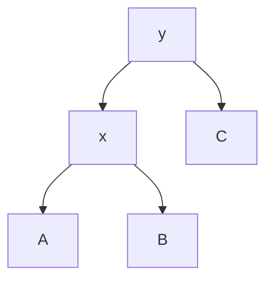
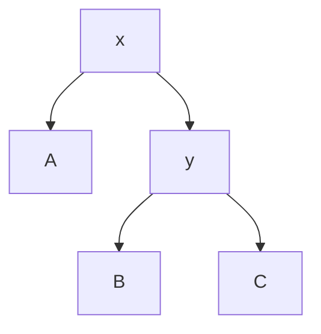

# 高级数据结构I

## 二叉搜索树

1. 二叉树的递归定义：
   - 空树是二叉树
   - 最多有两个子树的节点是一个二叉树
   - 任何将前两个规则应用有限次的结果是一个二叉树

2. 二叉树的保存，一个节点有三个指针与它的值，指针包含双亲与左右孩子

3. 二叉搜索树的定义：一棵二叉树，且每个节点的值大于其左子树的所有节点的值，小于其右子树的所有节点的值

4. 二叉搜索树的操作：
   - 中序遍历，得到一个有序序列，时间复杂度 $\Theta(n)$
   - 搜索，时间复杂度 $\Theta(h)$，其中 $h$ 为树的高度，在树**平衡**时时间复杂度为 $\Theta(\lg n)$
   - 访问树上最小或最大的节点，则只需向左子树或右子树不断递归即可，时间复杂度 $\Theta(h)$

5. 二叉搜索树上的搜索是尾递归，可以改为循环；递归更直接，但循环效率更高

6. 前驱与后继：对在树上的节点 $x$，其前驱是小于 $x$ 的最大节点，其后继是大于 $x$ 的最小节点；因为两者对称，以下考虑后继，时间复杂度为 $O(h)$
   - 对于一个节点，若其有非空右子树，则其后继为右子树上最大的节点
   - 对于一个节点，若其右子树为空，则其后继是其**最近的一个祖先，而这个祖先的左孩子是这个节点的祖先**

7. 插入：从根节点开始，若待插入节点的值小于当前节点，则向左子树递归，否则向右子树递归，直到找到一个空节点，将待插入节点插入到这个空节点上，时间复杂度 $O(h)$

8. 删除：删除一个节点 $x$，时间复杂度为 $O(h)$
   - 若 $x$ 无左子树，则直接用右子树替换 $x$
   - 若 $x$ 无右子树，则直接用左子树替换 $x$
   - 若 $x$ 既有左子树又有右子树，则将 $x$ 的后继和 $x$交换，此时 $x$ 没有左子树，删除此时的 $x$，用右子树替换即可

9. 一棵随机构造的二叉搜索树的高度为 $O(\lg n)$

10. 平衡二叉树：每个节点的两棵子树高度最多相差 1，高度也为 $O(\lg n)$ 
    - 证明：使用递归，假设子树高度为 $h_1,h_2$，则双亲节点高度为 $h=\max(h_1,h_2)+1$，子树节点数最少为 $f(h_1),f(h_2)$，总节点数最少为 $f(h_1)+f(h_2)+1$，而 $f(0)=1,f(1)=2$，对应 $f(h)+1=f(h-1)+1+f(h-2)+1$，即 $f(h)=\frac{1}{\sqrt{5}}(\frac{1+\sqrt{5}}{2})^{h+2}-1$，$h=O(\lg f(h))=O(\lg n)$

## 红黑树

1. 红黑树是一种保证**平衡**的二叉搜索树，高度为 $O(\lg n)$，操作**最坏**时间复杂度为 $O(\lg n)$

2. 时间复杂度变低，空间复杂度变高
   
3. 红黑树在二叉搜索树上对每个节点添加了一个颜色位，且将原本的空指针 (空子树)作为叶节点，称为 NIL
   - 每个节点是红色或黑色的
   - 根节点是黑色的
   - 每个叶节点 (NIL) 是黑色的，保证**每个真实节点有两个子树**
   - 若一个节点是红色的，则其两个子节点都是黑色的，保证**不会有两个连续的红色节点**
   - 对每个节点，从该节点到其所有后代叶节点的简单路径上，均包含相同数目的黑色节点，保证**从根节点到叶节点的最长路径不会超过最短路径的两倍**

4. 定义一个节点的高为最长简单路径上的边数，定义黑高为从该节点到其后代叶节点的所有简单路径 (不包括本身)上的黑色节点数

4. 任何一个高为 $h$ 的节点的黑高至少为 $h/2$，由此我们有定理：$n$ 个内部节点的红黑树的高度至多为 $2\lg(n+1)$
   - 证明：可以用归纳法得出任何一棵以节点 $x$ 为根的子树至少含有 $2^{bh(x)}-1$，则 $n\geqslant 2^{bh(root)}-1\geqslant 2^{h/2}-1\Rightarrow h\leqslant 2\lg(n+1)$

5. 旋转，时间复杂度 $O(1)$

6. 插入
   - 将 $x$ 插入，颜色设为红色
   - 如果只破坏了红色节点两子节点为黑色的性质，则只需要变色
   - 如果破坏了每个节点到其后代叶节点的简单路径上黑色节点数相同的性质，则需要旋转
   - 总时间复杂度为 $O(\lg n)$

7. 删除
   - 如果删除节点是红色的，则直接删除
   - 如果删除节点是黑色的，则将其记账在替换其的那个节点上
     - 若替换节点是红色的，则将其颜色改为黑色即可
     - 若替换后兄弟节点为红色，需要旋转后调色，化为另一种情况
     - 若替换后兄弟节点为黑色，且两个子节点为黑色，则将该兄弟节点变为红色，将记账的黑色上升一层，继续调整
     - 若替换后兄弟节点为黑色，右节点为红色，则旋转后调色
     - 若替换后兄弟节点为黑色，右节点为黑色，左节点为红色，则旋转该兄弟节点后调色，化为另一种情况

## 增广数据结构

1. 动态顺序统计：在红黑树上增加一个域，记录以该节点为根的子树的节点数，可以在 $O(\lg n)$ 时间复杂度内得到第 $i$ 小的元素

2. 增广数据结构的步骤
   - 找到一种基础的数据结构
   - 决定要增广的信息
   - 验证增广信息是否便于维护
   - 设计新的操作

3. 区间树的增广，添加一个当前子树上最大值的域，可以在 $O(\lg n)$ 时间复杂度内得到某个节点与查找区间相重叠